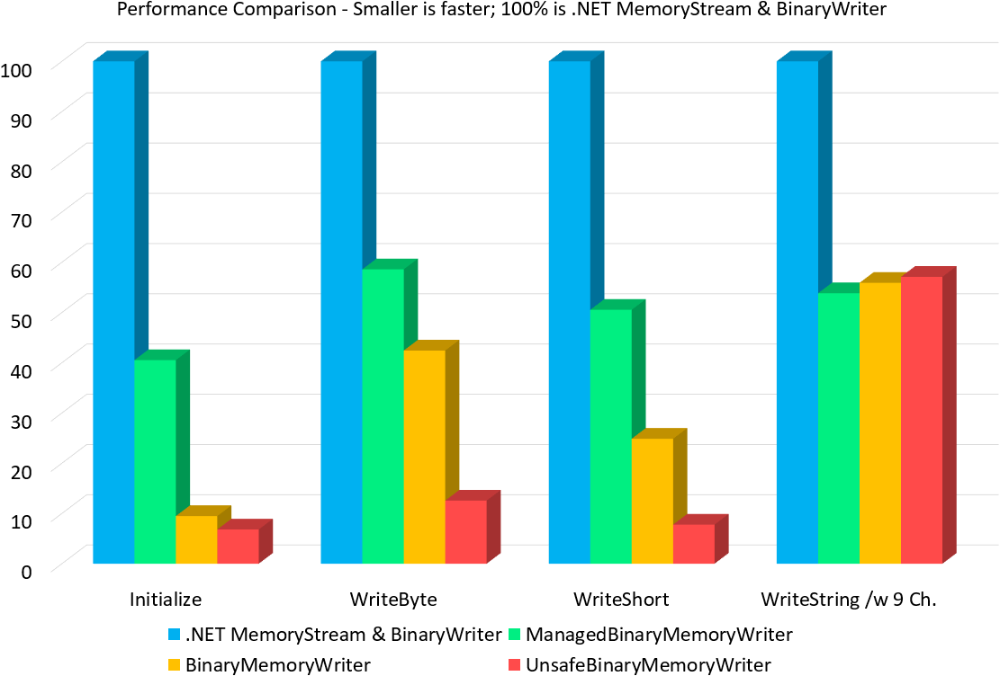

# Introduction

`BinaryMemoryReaderWriter` is a memory reader and writer mostly compatible to the `BinaryReader` and `BinaryWriter` of the .NET Framework.

The main aim is to build readers and writers which perform the best possible way. The `BinaryReader` or -`Writer` of the .NET framework uses a `Stream` to write to. If you want to write to a `byte[]` this approach is generally more slow compared to writing directly to the memory like the `BinaryReaderWriter` of this library does.

The performance compared to the `BinaryWriter` and `MemoryStream` combination looks as follows:



*Those values are generated (see `PerformanceComparison` sub project) via `BenchmarkDotNet`.*

# Should you use these structs?

Do you have a performance problem which really is caused by the CPU? (You most probably don't.) Don't use these readers and writers if your performance issues are caused by other components, like the network interfaces or disks.

It generally is a good idea to write code with good performance. However, you should also consider compatibility, etc. And the most compatible way of doing things is to just use components and classes out of the primary framework (.NET Framework).

# How to use those structs?

There are 2 ways:

1. Check out the project, build the library and use it. You should also do the tests to check if everything is all right.
2. Copy the structs you need to your code and use it. With this method you don't need an external library and therefore you have no external dependency.

You need to compile your program with `/unsafe` when copying this code to your codebase.

# Coding example

You should look at the Tests of the project. There you may find out how all of the methods can be used.

You can write an `unsigned integer` to a `byte[]` like this:

```csharp
byte[] data;

unsafe
{
    data = new byte[4];

    fixed (byte* pData = data)
    {
        BinaryMemoryWriter writer = new BinaryMemoryWriter(pData, 4);

        writer.Write(0xDEADBEEFu);
    }
}
```

You can also do more complex scenarios with these readers and writers. I, for instance use them to build advanced data structures where some information are available after writing the main content:

```csharp
unsafe
{
    byte[] data = new byte[1024];

    fixed (byte* pData = data)
    {
        UnsafeBinaryMemoryWriter writer = new UnsafeBinaryMemoryWriter(pData);

        writer.Write(1337); // Write something header like.

        // Store the current position in size.
        UnsafeBinaryMemoryWriter size = writer;

        // Make a free slot of 2 bytes.
        writer.Jump(2);

        writer.Write(27392L); // Some other data.

        // Fill the previous slot with information which got available right now.
        size.Write((short)42);
    }
}
```

Storing the current location like this is quite effective because it's just making a copy of one pointer. Or in the case of the not `Unsafe` writer it's additionally the size which will be copied.

# What to consider?

* Those readers and writers aren't classes. They are structs. This means, you should pass them via the `ref` keyword, if you want to pass them to another method.
* The readers with `Unsafe` in their name are *unsafe*. They will just continue writing over the memory borders. Also the `Unsafe` versions will not check parameters like the `step` size of the `Jump` method. Beware!